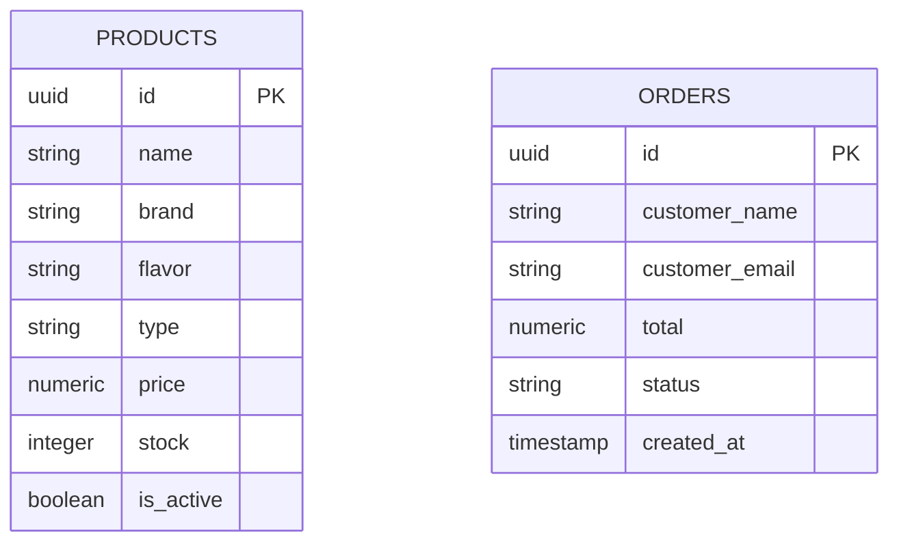

# Documentación del Proyecto: Vape Marketplace (The V Society)

Esta documentación ha sido generada mediante una auditoría y análisis exhaustivo del código fuente, estructura, base de datos y flujos del proyecto. Su objetivo es servir como guía definitiva para nuevos desarrolladores.

---

## 1. Información General del Proyecto

* **Nombre del proyecto:** Vape Marketplace (The V Society)
* **Objetivo principal:** Proveer una plataforma integral para la venta, distribución nacional y al detal de productos de vapeo, integrando tanto un catálogo e-commerce para clientes finales como un sistema POS (Punto de Venta) y panel administrativo.
* **Problema que resuelve:** Centraliza las ventas físicas y online de productos de vapeo, gestionando inventario (stock), control de edad legal obligatoria, procesamiento de órdenes y exhibición de catálogo con filtros específicos (sabor, marca, tipo).
* **Usuarios objetivo:**
  * **Clientes finales:** Usuarios mayores de edad (+18) que compran productos online.
  * **Administradores:** Personal que gestiona el inventario, aprueba órdenes y visualiza métricas de ventas.
  * **Cajeros/Staff:** Personal que utiliza el POS para ventas físicas.
* **Alcance funcional:** Catálogo público con carrito de compras, verificación de edad, panel administrativo (Dashboard, CRUD de Productos, Gestión de Órdenes) y módulo POS para facturación física.
* **Estado actual del desarrollo:** MVP funcional (Versión 0.1.0) con Next.js App Router, integración con Supabase en funcionamiento, carrito persistente local y diseño responsivo terminado.

---

## 2. Arquitectura General

El proyecto utiliza una arquitectura **Cliente-Servidor Serverless** basada en **Next.js (App Router)** y **Supabase** (BaaS - Backend as a Service).

* **Patrón de diseño principal:** Componentes Funcionales, Server Components para carga de datos inicial (SSR/SSG), y Client Components para interactividad. Separación de lógica de estado global (Zustand) y persistencia (Supabase).
* **Flujo general de funcionamiento:**
  1. El usuario accede a la web, el servidor de Next.js renderiza la página (Server Components).
  2. El middleware de Next.js intercepta la petición para verificar sesiones y validaciones de edad.
  3. Las peticiones a la base de datos se hacen directamente desde los Server Components utilizando el cliente de Supabase (SSR).
  4. La interactividad de UI y el carrito de compras son manejados en el navegador mediante React y Zustand.
* **Comunicación entre módulos:** Los componentes comparten información del carrito vía memoria local (Zustand) y operaciones de inventario/órdenes vía peticiones asíncronas a Supabase.

```mermaid
flowchart TD
    Usuario((Usuario)) --> NextMiddleware[Middleware de Next.js\nVerifica Edad y Sesión]
    NextMiddleware --> UI[Frontend / Next.js Server & Client Components]
    UI -- "Estado del Carrito" --> Zustand[(Zustand Local Storage)]
    UI -- "Lectura/Escritura DB" --> SupabaseAuth[Supabase Auth / SSR Client]
    SupabaseAuth --> SupabaseDB[(Supabase PostgreSQL)]
    SupabaseAuth --> SupabaseStorage[Supabase Storage\n(Imágenes)]
```

---

## 3. Stack Tecnológico

| Tecnología | Uso dentro del proyecto |
| :--- | :--- |
| **Next.js 16.2** | Framework de React, enrutamiento (App Router), Server Components y Middlewares. |
| **React 19** | Construcción de interfaces de usuario y componentes interactivos. |
| **Tailwind CSS v4** | Sistema principal de estilos y diseño responsivo (Utility-first). |
| **Supabase (SSR)** | Base de datos PostgreSQL, autenticación, almacenamiento de imágenes de productos. |
| **Zustand** | Gestión del estado global en el cliente (Específicamente para el carrito de compras). |
| **TypeScript** | Tipado estático del código para mayor fiabilidad y mantenimiento. |

---

## 4. Estructura de Carpetas

```text
vape-marketplace/
├── app/                  # Rutas de Next.js (App Router)
│   ├── admin/            # Panel administrativo protegido (productos, órdenes)
│   ├── carrito/          # Vista del carrito de compras
│   ├── checkout/         # Proceso de pago/finalización de compra
│   ├── home/             # Landing page principal
│   ├── login/            # Autenticación
│   ├── pos/              # Interfaz de Punto de Venta (Point of Sale)
│   ├── tienda/           # Catálogo público de productos
│   └── verificar-edad/   # Gateway de validación legal para +18
├── components/           # Componentes reutilizables de UI
│   ├── admin/            # Componentes específicos del dashboard
│   ├── pos/              # Componentes del punto de venta
│   ├── tienda/           # Cards de producto, filtros, etc.
│   └── ui/               # Componentes genéricos (Toast, etc.)
├── lib/                  # Lógica de negocio, configuración y utilidades
│   ├── store/            # Estado global con Zustand (cart.ts)
│   ├── supabase/         # Clientes de Supabase para cliente y servidor
│   └── utils/            # Funciones helper (formateo de moneda, etc.)
├── public/               # Assets estáticos (imágenes, favicons)
└── middleware.ts         # Middleware global para protección de rutas y age-gate
```

---

## 5. Flujo Funcional Completo

**Flujo de Cliente Regular:**
1. **Acceso:** El usuario ingresa al dominio. El `middleware.ts` intercepta la solicitud.
2. **Age Gate:** Si no existe la cookie `age_verified`, es redirigido a `/verificar-edad`.
3. **Catálogo:** Tras aceptar, navega a `/tienda`. El Server Component hace un query a Supabase (`select * from products`) y renderiza la lista.
4. **Interacción:** El usuario filtra por sabor/marca o añade productos. La acción "Agregar" dispara `addItem` de Zustand, actualizando el badge del `CartButton`.
5. **Checkout:** Navega al `/carrito` y luego procede al `/checkout` para registrar su orden, lo cual insertará un registro en la tabla `orders` de Supabase con estado `pending_payment`.

**Flujo de Administrador:**
1. **Autenticación:** Ingresa en `/login` o `/admin/login`.
2. **Verificación:** El middleware valida el token de Supabase Auth o la cookie `vape_role=admin`.
3. **Gestión:** Accede a `/admin` (dashboard estadístico). Puede ir a `/admin/productos` para crear/editar productos (sube imagen a Supabase Storage, inserta registro) o a `/admin/ordenes` para cambiar el estado de las compras.

---

## 6. Módulos del Sistema

### Módulo: Tienda (Catálogo)
* **Objetivo:** Exhibir productos a los clientes con filtros eficientes.
* **Componentes:** `ProductCard`, `Filtros`, `Navbar`.
* **Archivos Principales:** `app/tienda/page.tsx`, `components/tienda/ProductCard.tsx`.
* **Flujo Interno:** Consulta SSR a `products` filtrando activos. Extrae dinámicamente marcas, sabores y tipos únicos para popular los filtros laterales.

### Módulo: Carrito y Checkout
* **Objetivo:** Acumular intención de compra y procesar el pedido.
* **Dependencias:** `zustand`, `localStorage`.
* **Flujo Interno:** Almacenamiento persistente en navegador. En el checkout, convierte los ítems del Zustand state en registros atados a una orden en DB y luego limpia el estado.

### Módulo: Panel Administrativo
* **Objetivo:** Control total operativo del negocio.
* **Componentes:** Dashboard charts, Tablas de CRUD, Formularios de edición.
* **Archivos Principales:** `app/admin/page.tsx`, `app/admin/productos/page.tsx`, `app/admin/ordenes/page.tsx`.
* **Flujo Interno:** Lectura de métricas (stock bajo, órdenes recientes) vía Supabase aggregate queries. Mutaciones directas sobre la base de datos para CRUD.

### Módulo: POS (Point of Sale)
* **Objetivo:** Interfaz rápida para vendedores físicos.
* **Archivos Principales:** `app/pos/page.tsx`, `components/pos/POSDashboard.tsx`.
* **Flujo Interno:** Vista adaptada para escaneo/búsqueda rápida, suma automática y deducción inmediata de inventario local.

---

## 7. Sistema de Autenticación

* **Proveedor:** Supabase Auth + Gestión propia de roles por cookies.
* **Protección de Rutas:** Centralizado en `middleware.ts`.
* **Tokens y Cookies:** 
  * Supabase gestiona JWT internamente mediante la librería SSR.
  * El sistema utiliza una cookie adicional llamada `vape_role` para asignar roles rápidos y un fallback (e.g. `vape_role=admin` o `vape_role=pos`).
  * Cookie `age_verified=true` para saltar el Age Gate.
* **Flujo:** Si un usuario intenta entrar a `/admin/*`, el middleware lee `vape_role`. Si no existe o no tiene nivel, valida la sesión de Supabase. Si no hay sesión válida, redirige a `/login`.

---

## 8. Sistema de Roles y Permisos

| Rol | Permisos y Accesos |
| --- | --- |
| **Usuario / Público** | Acceso a `/tienda`, `/carrito`, `/checkout`, `/verificar-edad`. Puede crear órdenes. |
| **POS (Cajero)** | Acceso al módulo `/pos`. Solo puede realizar y registrar ventas físicas restando stock. |
| **Admin** | Acceso total a `/admin/*` (Dashboard, Productos, Órdenes) y a la vista `/pos`. |

---

## 9. Base de Datos

Basado en el análisis de consultas (queries), el esquema en **Supabase PostgreSQL** es el siguiente:

### Tablas Principales

* **`products`**: Almacena el inventario.
  * *Campos:* `id` (PK), `name`, `brand`, `flavor`, `type`, `price`, `stock`, `description`, `images` (text array o json), `is_active` (boolean).
* **`orders`**: Registro de pedidos.
  * *Campos:* `id` (PK), `status` (pending_payment, verifying, paid, shipped, delivered), `total`, `customer_name`, `customer_email`, `created_at`.
* **`age_verifications`**: Registro legal de aceptación.
  * *Campos:* `id`, timestamp, user_data.


*(Nota: No se halló en el código fuente frontend una inserción explícita a tabla `order_items`, asumiendo estructuración en metadata o pendiente de refactor)*

---

## 10. Integración con Supabase

* **Auth:** Vía `@supabase/ssr` con `createServerClient` y `createBrowserClient`.
* **Database:** Consultas estructuradas como `supabase.from('products').select('*')`.
* **Storage:** Utiliza un bucket llamado `product-images` para la carga visual del catálogo (`supabase.storage.from('product-images').upload()`).
* **Políticas RLS (Row Level Security):** Se asume que las políticas están configuradas a nivel BD permitiendo `select` público a `products` (donde `is_active=true`) y restringiendo inserts/updates a usuarios autenticados.

---

## 11. APIs y Servicios

El proyecto prescinde de endpoints API tradicionales de Next.js (`app/api/*`) y se inclina por el acceso directo a Supabase en Server Components y llamadas directas en componentes de cliente.

**Ejemplo de "Servicio" interno (Lectura Catálogo):**
* **Ruta (Física):** `app/tienda/page.tsx`
* **Método:** Server-side fetch.
* **Flujo:** Evalúa `searchParams` -> Concatena filtros de consulta -> Ejecuta `await query` -> Pasa array al componente de UI.

---

## 12. Componentes Frontend Críticos

* **`ProductCard`** (`components/tienda/ProductCard.tsx`): 
  * **Propósito:** Mostrar producto, manejar click de "Agregar a Carrito" y expandir modal con detalles.
  * **Props:** `product` (Interface Product).
  * **Estados:** `justAdded`, `isOpen` (Modal), `activeImage`.
  * **Dependencias:** Llama a `useCart()` de Zustand.
* **`POSDashboard`** (`components/pos/POSDashboard.tsx`):
  * **Propósito:** Panel operativo táctil para ventas físicas. Maneja su propio estado de carrito temporal, y actualiza la BD de Supabase restando el `stock` en vivo.
* **`Navbar`** (`components/Navbar.tsx`):
  * **Propósito:** Navegación principal, evalúa ruta activa y muestra el contador en vivo del carrito suscrito a Zustand.

---

## 13. Hooks Personalizados

* **`useCart`** (Ubicado en `lib/store/cart.ts`):
  * **Objetivo:** Abstraer el acceso al store de Zustand para componentes.
  * **Retorno:** 
    * `items` (Array de CartProduct)
    * `count` (Total de unidades)
    * `total` (Suma total en dinero)
    * Mutadores: `addItem`, `removeItem`, `updateQuantity`, `clearCart`.

---

## 14. Gestión de Estado

* **Zustand Local:** Utilizado a través de `useCartStore`.
* **Persistencia:** Está configurado con `persist` y `createJSONStorage(() => localStorage)`. Esto garantiza que los clientes mantengan su carrito activo incluso si cierran la pestaña o recargan la página.
* **Estado en React:** Se usa moderadamente `useState` en componentes cliente para UI efímera (Modales, Toasts de notificación, selects de filtrado).

---

## 15. Flujo de Administración

El sistema para Administradores es robusto:
1. **Dashboard (`/admin`):** Promesas concurrentes `Promise.all` a Supabase que traen totales de productos, stock bajo, conteo de órdenes y sumatoria financiera de órdenes con estados positivos (paid, shipped, delivered).
2. **Productos (`/admin/productos`):** Lista con tabla responsiva. Botón "Nuevo" lleva a `/admin/productos/nuevo`, sube archivo físico a Supabase Storage, obtiene `publicUrl` y guarda el registro con estado `is_active`.
3. **Órdenes (`/admin/ordenes`):** Tabla interactiva donde el admin cambia el dropdown de `status`. Un `onChange` muta directamente `status` en Supabase y hace optimistic UI update.

---

## 16. Seguridad

* **Middleware Interceptor:** La ruta `/admin/*` y `/pos` están protegidas a nivel del edge server de Next.js, previniendo visualización de interfaces privadas.
* **Age-Gate Legal:** Obligatorio en el e-commerce (regulado para productos de tabaco/nicotina). Redirección estricta si no existe validación previa.
* **Validación de variables de entorno:** Archivo `client.ts` asegura la existencia del `SUPABASE_URL` antes de inicializar clientes, previniendo leaks o crashes indeseados.

---

## 17. Variables de Entorno

Archivo base requerido: `.env.local`

| Variable | Propósito |
| --- | --- |
| `NEXT_PUBLIC_SUPABASE_URL` | Endpoint público del proyecto en Supabase. Requerido para conexión. |
| `NEXT_PUBLIC_SUPABASE_ANON_KEY` | Clave anónima pública de Supabase (Lectura base y autenticación). |

---

## 18. Dependencias Críticas

Del `package.json`:
* **`next` / `react`:** Base del framework.
* **`@supabase/ssr` / `@supabase/supabase-js`:** Conexión estandarizada, manejo de cookies seguras y queries.
* **`zustand`:** Minimiza re-renders y maneja el estado global del checkout y carrito de manera elegante sin el boilerplate de Redux.
* **`tailwindcss` (@tailwindcss/postcss):** Styling nativo de todo el proyecto usando el nuevo motor V4 de Tailwind.

---

## 19. Flujo de Despliegue

* **Build:** `npm run build` transpilará TypeScript y generará páginas estáticas/servidoras de Next.js.
* **Producción:** Desplegable nativamente en **Vercel** de manera óptima por utilizar Server Components.
* **Requisitos:** Es vital inyectar las variables de entorno de Supabase en el dashboard del servicio de hosting.
* **Edge/Middleware:** Al usar `middleware.ts`, se ejecuta en Vercel Edge Networks, garantizando que el bloqueo de acceso / validación de edad sea casi instantáneo sin costo a la base de datos principal.

---

## 20. Deuda Técnica Encontrada

1. **Tipado de Base de Datos:** No se halló un archivo unificado de tipos de base de datos generado por Supabase CLI (ej. `database.types.ts`), provocando que existan interfaces `Product` repetidas manualmente en múltiples archivos de frontend.
2. **Tablas relacionales en Órdenes:** Las órdenes parecen guardar un array estático o faltar en la gestión UI. Si las ventas crecen, la normalización creando tabla `order_items` será estricta y obligatoria.
3. **Validación de Roles por Cookie manual (`vape_role`):** Si bien Supabase Auth es seguro, basar la redirección administrativa principal verificando el string de una cookie no encriptada (`vape_role='admin'`) es riesgoso en producción si no se complementa rigurosamente con políticas RLS a nivel de base de datos.

---

## 21. Guía para Nuevos Desarrolladores

### Cómo Instalar y Ejecutar
1. Clonar el repositorio.
2. Copiar `.env.local` y agregar credenciales de Supabase válidas.
3. Instalar dependencias: `npm install`
4. Ejecutar servidor de desarrollo: `npm run dev`

### Cómo crear nuevas funcionalidades
* **Componentes visuales:** Crearlos en `components/ui/` si son genéricos, o en subcarpetas (`components/tienda/`) si son acoplados. Usa siempre Tailwind v4.
* **Páginas:** Agregar carpeta dentro de `app/` (ej: `app/mis-compras/page.tsx`).
* **Queries a DB:** Si es renderizado inicial, haz la consulta de Supabase en el Server Component (`page.tsx`) usando `createClient` de `lib/supabase/server.ts`.

### Tipos Compartidos (Mejora Recomendada)
Al iniciar a trabajar, genera los tipos de Supabase y centralízalos en `lib/types/database.ts` para no tener que estar redeclarando `interface Product`.

---

## 22. Resumen Ejecutivo

El proyecto **Vape Marketplace** es una solución e-commerce y operativa altamente estética, moderna y veloz, apalancada en **Next.js App Router** y **Supabase**. 

Su ciclo de vida es claro: valida la mayoría de edad de los clientes, les ofrece un catálogo performante con filtros en tiempo real, gestiona un carrito mediante Zustand y finalmente procesa la venta. Paralelamente provee a los dueños de negocio un módulo robusto para gestionar su inventario, cambiar los estados de los pedidos e incluso despachar presencialmente mediante un módulo POS.

**Puntos críticos que un dev nuevo debe entender:**
1. Todo el acceso a datos ocurre directamente en los archivos de la carpeta `app/` (Server Components) para la carga inicial de páginas.
2. La protección y validación de edad reside centralmente en `middleware.ts`.
3. El store de estado global `useCart` (Zustand) es la columna vertebral del comercio frontend; nunca usar `localStorage` manualmente para el carrito.

Cualquier expansión futura debería concentrarse en estandarizar el tipado global de Supabase y refinar la seguridad RLS y claims de roles de administrador.
